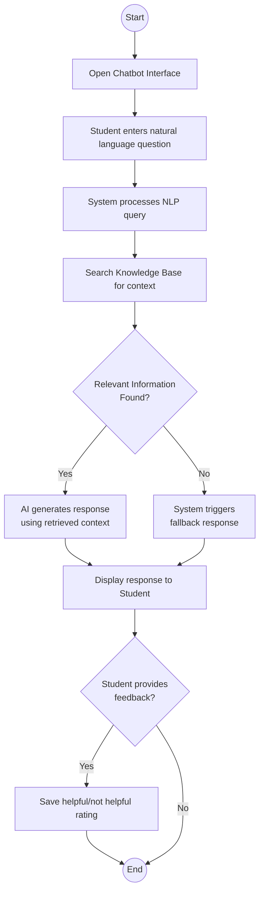

# Activity Diagram

## 1. Diagram Title
**AI-Powered University Helpdesk Chatbot - Question/Answer Workflow Activity Diagram**

## 2. Purpose
This diagram models the complete operational workflow of a single student inquiry from start to finish. It visually maps the decision points (such as the fallback mechanism) ensuring that the SRS requirement for handling unknown questions is clearly defined in the logical flow.

## 3. Actors/Components Involved
- Student
- System (NLP, DB, AI)

## 4. UML Diagram

## 5. Short Explanation
The workflow begins when the student opens the interface and submits a question. The system processes the query and checks the knowledge base. A crucial decision node branches the logic: if data is found, a factual response is generated; if not, a fallback mechanism is engaged (as mandated by FR-05). Both paths converge at the display step. Finally, an optional branch allows the student to submit feedback before the activity concludes.
