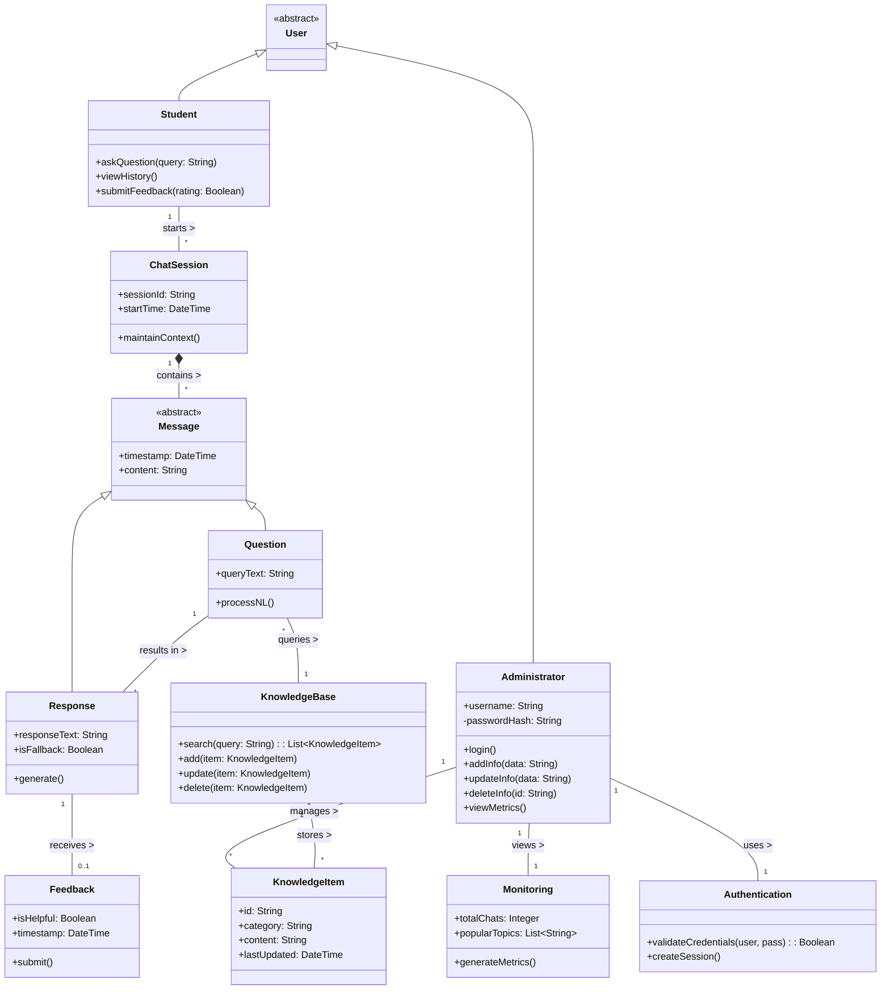

# Class Diagram

## 1. Diagram Title
**AI-Powered University Helpdesk Chatbot - Conceptual Class Diagram**

## 2. Purpose
This diagram models the conceptual entities, data structures, and relationships described in the SRS Data Requirements. It shows how the system logically organizes users, messages, the knowledge base, and administrative functionality.

## 3. Classes Involved
Student, Administrator, ChatSession, Message, Question, Response, Feedback, KnowledgeBase, KnowledgeItem, Authentication, Monitoring.

## 4. UML Diagram

## 5. Short Explanation
The diagram defines a base `User` class extended by `Student` and `Administrator`. A `Student` interacts through a `ChatSession`, which aggregates `Message` objects. Messages are specialized into `Question` and `Response`. A `Response` may optionally receive `Feedback`. The `Administrator` authenticates via the `Authentication` class, manages `KnowledgeItem` entities stored within the `KnowledgeBase`, and views usage via the `Monitoring` class. The design is kept language-neutral and purely conceptual.
