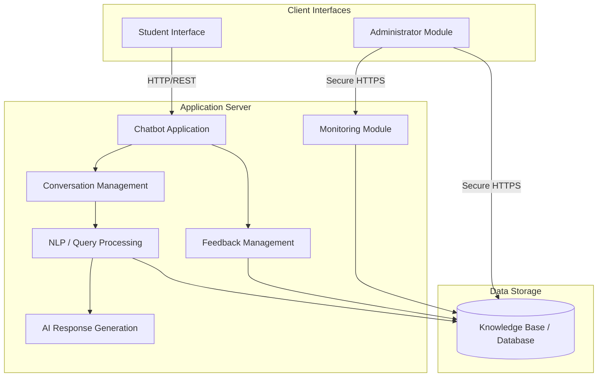

# Component Diagram

## 1. Diagram Title
**AI-Powered University Helpdesk Chatbot - System Component Diagram**

## 2. Purpose
This diagram represents the major logical software components of the system and the interfaces/dependencies between them. It demonstrates how the system is modularized, adhering to the maintainability constraints specified in the SRS.

## 3. Components Involved
- Presentation Layer: Student Interface, Administrator Module
- Application Layer: Chatbot Application, Conversation Management, NLP / Query Processing, AI Response Generation, Monitoring Module, Feedback Management
- Data Layer: Knowledge Base

## 4. UML Diagram

## 5. Short Explanation
The system is divided into logical tiers. The Client Interfaces (Student and Admin) interact via HTTP with the Application Server. The core `Chatbot Application` utilizes `Conversation Management` for session tracking, which in turn relies on `NLP / Query Processing` to understand text. The NLP component queries the `Knowledge Base` database and passes context to `AI Response Generation`. `Monitoring` and `Feedback Management` operate alongside the core flow, interacting directly with the data layer to read metrics and write feedback ratings. No specific proprietary APIs or cloud vendors are assumed.
