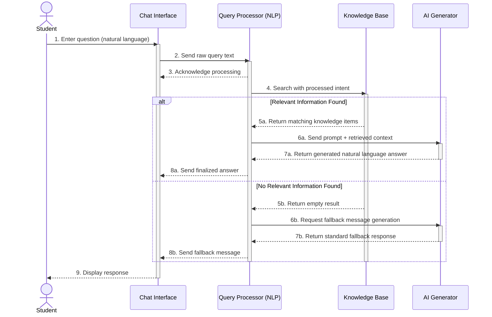
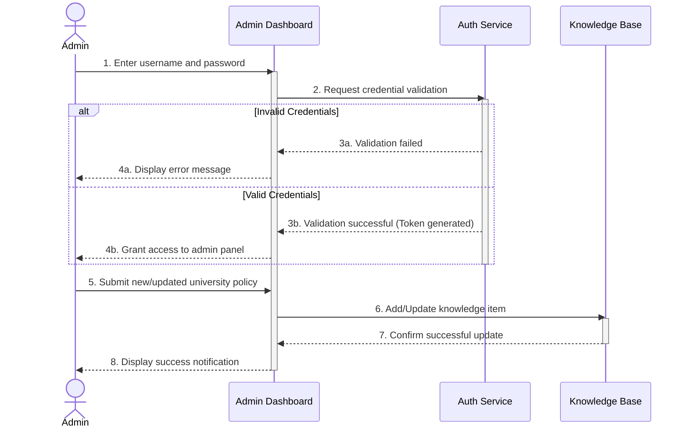

# Sequence Diagram

## 1. Diagram Title
**AI-Powered University Helpdesk Chatbot - Interaction Sequence Diagrams**

## 2. Purpose
This document presents two sequence diagrams: one detailing the chronological flow of a student asking a question (including normal response generation and fallback handling), and one showing the administrator login and knowledge base management process.

## 3. Actors/Components Involved
- **Actors**: Student, Administrator
- **System Components**: Chat Interface, Query Processor (NLP), Knowledge Base (DB), AI Generator, Admin Dashboard, Auth Service.

## 4. UML Diagrams

### Part 1: Student Question & Answer Sequence

### Part 2: Administrator Management Sequence

## 5. Short Explanation
The first sequence demonstrates the student workflow. The query processor coordinates the flow, first pinging the Knowledge Base. Based on whether the Knowledge Base returns relevant data, the system either tasks the AI Generator to formulate a factual answer or triggers the fallback protocol. 

The second sequence illustrates the administrator's workflow. The Admin must first securely authenticate via the Auth Service before being allowed to push new or updated documentation to the Knowledge Base.
