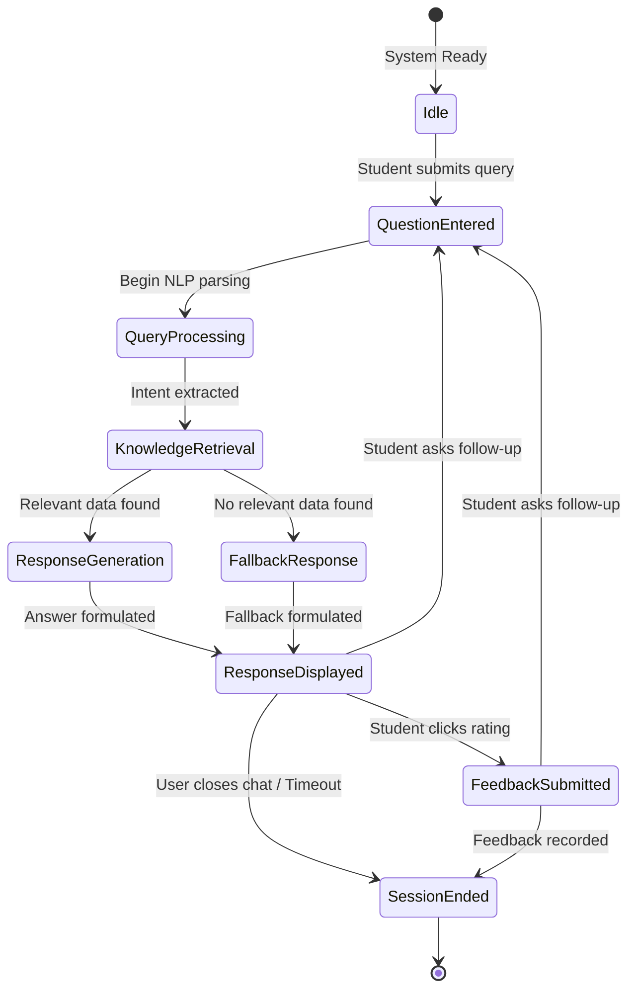

# State Machine Diagram

## 1. Diagram Title
**AI-Powered University Helpdesk Chatbot - Conversation Request Lifecycle**

## 2. Purpose
This diagram models the lifecycle and state transitions of a single chatbot conversation/request from the perspective of the system backend. It is essential for understanding how the system handles asynchronous API calls and maintains session context.

## 3. Entities Involved
The individual Chat Request / Active Session.

## 4. UML Diagram

## 5. Short Explanation
The system starts in an `Idle` state. Upon receiving a query, it transitions sequentially through `QueryProcessing` and `KnowledgeRetrieval`. Depending on the retrieval success, it enters either `ResponseGeneration` or `FallbackResponse`. Once the text is prepared, the state moves to `ResponseDisplayed`. From here, the user may trigger a `FeedbackSubmitted` state, end the session (`SessionEnded`), or enter a new question, looping the system back to `QuestionEntered` to maintain context.
