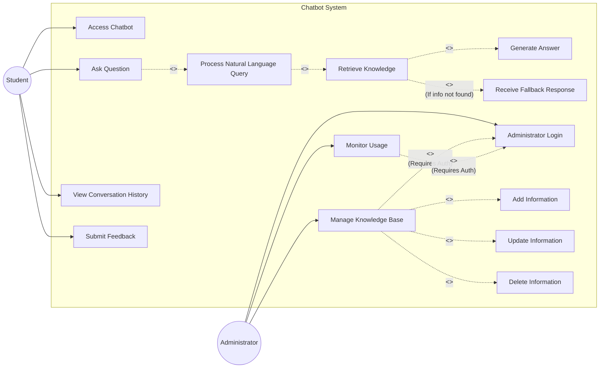

# Use Case Diagram

## 1. Diagram Title
**AI-Powered University Helpdesk Chatbot - Use Case Diagram**

## 2. Purpose
This diagram illustrates the primary interactions between external actors and the chatbot system. It visually represents the major functional requirements extracted from the SRS, including knowledge retrieval, query processing, fallback handling, and administrative management.

## 3. Actors Involved
- **Student**: The primary end-user seeking university information.
- **Administrator**: The university staff member managing the system.

## 4. UML Diagram

## 5. Short Explanation
The Student actor interacts with the system to ask questions, view history, and submit feedback. The process of asking a question inherently includes processing the natural language, retrieving knowledge, and generating an answer. If the knowledge is missing, the system extends the retrieve function to provide a fallback response. The Administrator actor must log in to monitor usage or manage the knowledge base, which involves adding, updating, or deleting university information.
